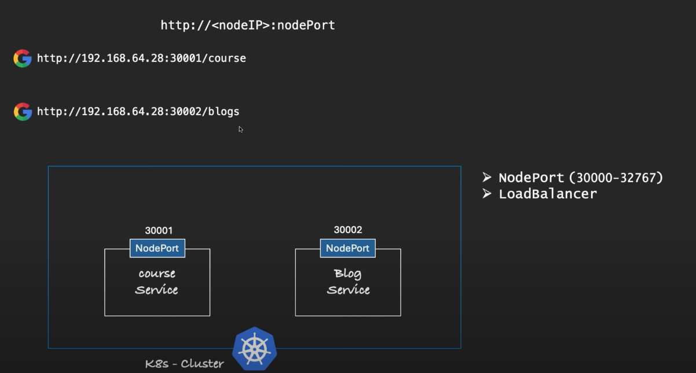
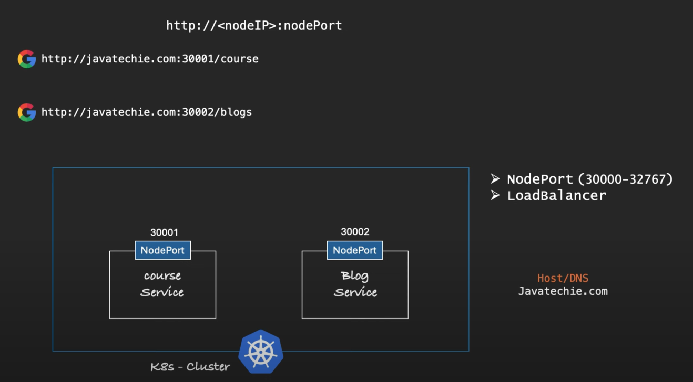
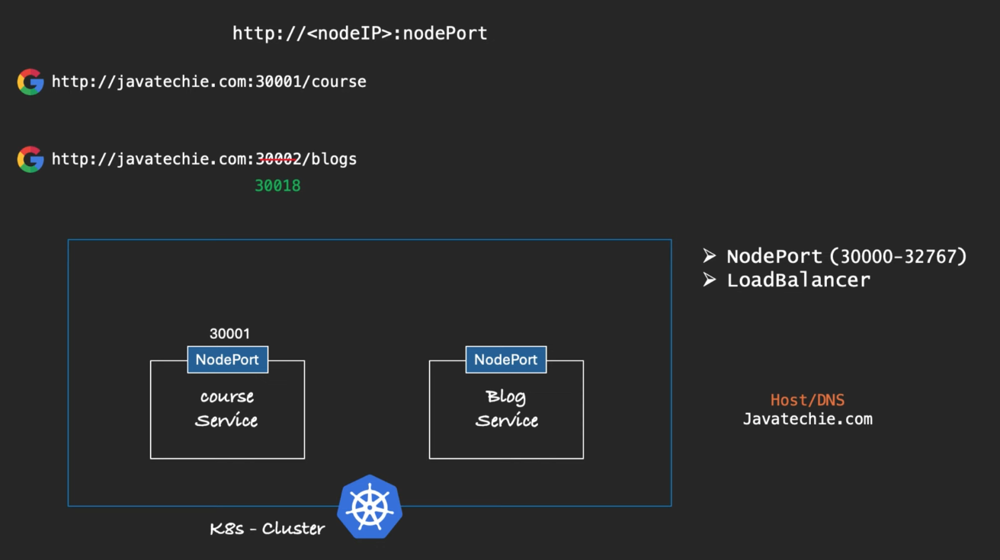
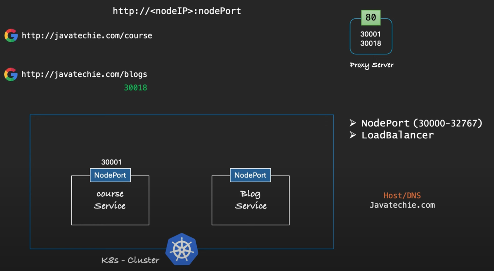
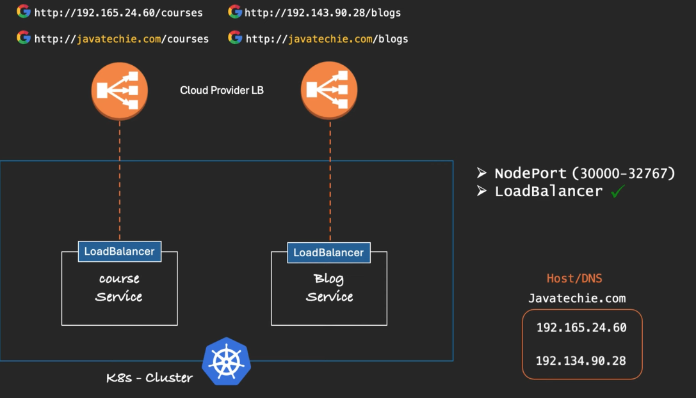
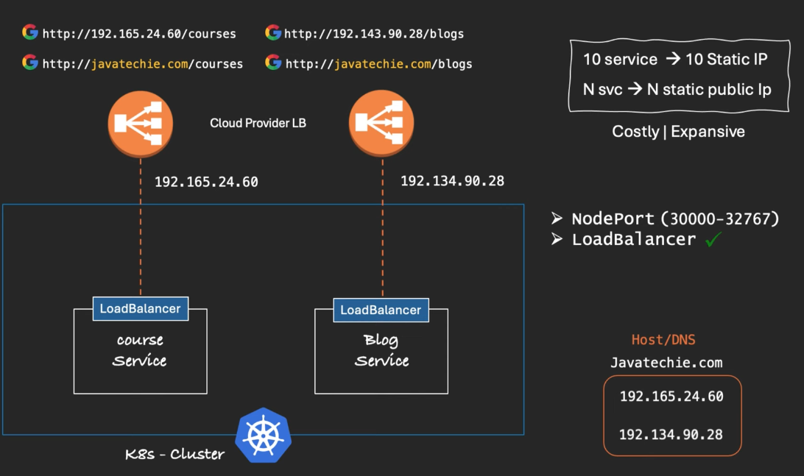
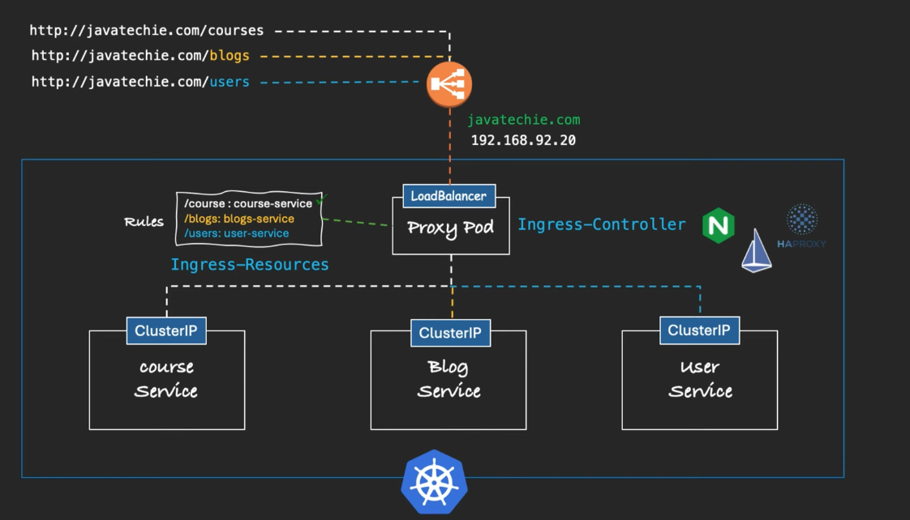

# Ingress
- we will see why we need ingress here as we already have loadbalancer and NodePort to expose k8s services.
- what challanges loadbalancer and NodePort have so we are using Ingress.

### Lets assume we have two applications which are running in a K8s cluster, and as we know K8s provides us to expose the application  by services like  

- * NodePort
- * LoadBalancer
- * ClusterIP (however the clusterip is used to access the resource within the K8s cluster) -- We can ignore this.

- ###  Problem with NodePort service.
     - Both the application are exposed using the NodePort service so now these services will be exposed with the port range 30000 - 32767.
     - And accessing these applications by Nodeip:nodePort i.e but this is suitable for deployment and testing purposes, not for production applications.
      
     - In Production applications users should not type the IP address and port to access the application.
     - Rather we need to provide a domain name and map the  IP address to the domain name, so ip addresses is mapped to DNS(Domain Name System) domain name , but one small issues is the port.
     
     - we can still see the port number when calling the application from domain name.
     so users needs to remember the node port number for each application to call the application, which is not recommended in real time. and one more thing is if the blob
     service is crashed and a new application is created which will have new port
     
     - For this we have a workaround, we need to use a proxy server which will run on port 80 and will forward the request to the application.
     - In this way we can access the application from domain name.
     
     but this will be a extra set of workload for the developer.

- ###  Problem with LoadBalancer service.
     - when applications are exposed as loadbalancer services, we can use any cloud provider to 
     get a static IP address to access the applications.and also when we have a static ip we can map this 
     ip address to the domain name system (DNS), and now ``we can access the application from domain name``.
     
     - But if we observe the two applications are getting two static ip addresses, this can be too expensive.whatif i had 10 applications
     then 10 diffrent static ip addresses will be required.
     

## Resolution for the above problem.
 - So lets assume we have 3 applications running in a K8s cluster and i will expose those applications using ClusterIP, now all the applications cannot be accessed externally or outside the cluster.
 the applications are only accessed within the K8s cluster.
 - We will create a proxy pod, all the external requests will be coming to this proxy pod.which will comminicate to our applications.
 - We will expose the proxy pod using the loadbalancer service and this way we can get the single static ip address and map it to the domain name.and even if we have  10 applications we can use same static ip addresses as the ip address is given to the proxy pod.
 - Now we can access the applications from domain name.
 - Now we can define the rules where we can tell for /blog go to the blog application and smilarly for other applications this is called path based routing.we can also define the rules where we can forward requests based on domain for eg blog.com to the blog application.
 - This proxy pod is nothing but ``Ingress-Controller`` in k8s world.
 - Where we define the rules from path or domain is nothing but ``Ingress-Resources`` which is a native object of K8s.
 - K8s does not have inbuilt support for  ``Ingress-Controller``  so we can use 3rd party Controller like ``Nginx`` , `Istio `, ``HA PROXY``.
 
 - Note: Minikube has Nginx Ingress-Controller by default.

    

