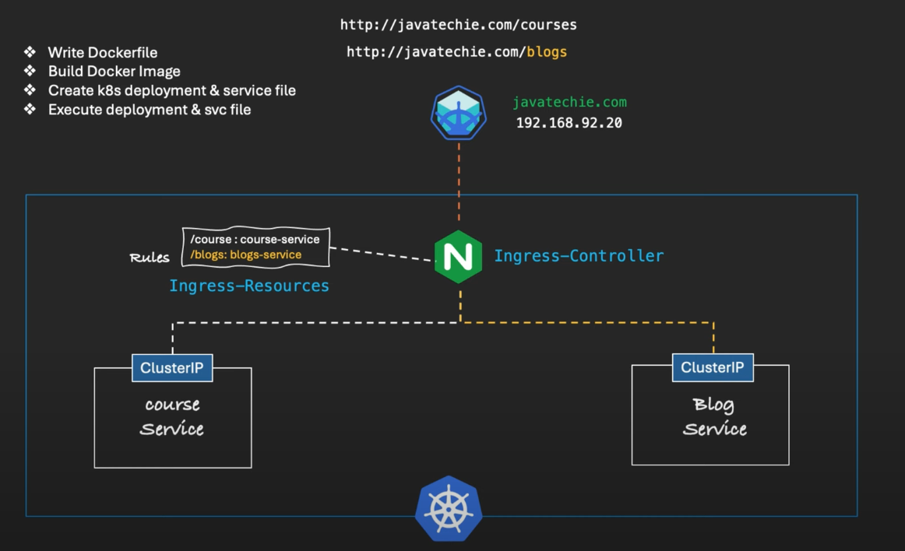

# Development Steps 
- Note: Minikube has Nginx Ingress-Controller by default.
- as we need an static ip , we will not use any cloud provider instead we will use minikube ip 
and map it our DNS.
- we will define rules in ingress-resources.
- project overview:



- We will use already created project and container made by javatechie.
- project overview both are simple restapi project which run on port 8080 and db is not configured.
-  already the docker image is created and pushed to docker hub.
- We need run this docker images in k8s cluster so we need to create manifest files for the 
each image.

- Mainfest files.
```
- blog service:

apiVersion: apps/v1
kind: Deployment
metadata:
  name: blog-service-deployment
spec:
  replicas: 2
  selector:
    matchLabels:
      app: blog-service
  template:
    metadata:
      labels:
        app: blog-service
    spec:
      containers:
        - name: blog-service
          image: javatechie4u/blog-service:2.0
          ports:
            - containerPort: 8080

---

apiVersion: v1
kind: Service
metadata:
  name: blog-service
spec:
  type: ClusterIP
  selector:
    app: blog-service
  ports:
    - protocol: TCP
      port: 80
      targetPort: 8080


- course service:

apiVersion: apps/v1
kind: Deployment
metadata:
  name: course-service-deployment
spec:
  replicas: 2
  selector:
    matchLabels:
      app: course-service
  template:
    metadata:
      labels:
        app: course-service
    spec:
      containers:
        - name: course-service
          image: javatechie4u/course-service:2.0
          ports:
            - containerPort: 8080

---


apiVersion: v1
kind: Service
metadata:
  name: course-service
spec:
  type: ClusterIP
  selector:
    app: course-service
  ports:
    - protocol: TCP
      port: 80
      targetPort: 8080

```

- Note we can see here the Service type is ClusterIP and not NodePort , and we will make the users to access the app from ingress controller.
- Enable the ingress controller and apply the application yaml files.
```
C:\Users\ashfa\OneDrive\Desktop\My-Learning\Java\Code\SB-k8s\k8s-ingress-demo\blog-service>minikube addons enable ingress
💡  ingress is an addon maintained by Kubernetes. For any concerns contact minikube on GitHub.
You can view the list of minikube maintainers at: https://github.com/kubernetes/minikube/blob/master/OWNERS
💡  After the addon is enabled, please run "minikube tunnel" and your ingress resources would be available at "127.0.0.1"
    ▪ Using image registry.k8s.io/ingress-nginx/kube-webhook-certgen:v1.4.3
    ▪ Using image registry.k8s.io/ingress-nginx/controller:v1.11.2
    ▪ Using image registry.k8s.io/ingress-nginx/kube-webhook-certgen:v1.4.3
🔎  Verifying ingress addon...
🌟  The 'ingress' addon is enabled

C:\Users\ashfa\OneDrive\Desktop\My-Learning\Java\Code\SB-k8s\k8s-ingress-demo\blog-service>kubectl apply -f k8s-config.yaml
deployment.apps/blog-service-deployment created
service/blog-service created

C:\Users\ashfa\OneDrive\Desktop\My-Learning\Java\Code\SB-k8s\k8s-ingress-demo\blog-service>cd ..

C:\Users\ashfa\OneDrive\Desktop\My-Learning\Java\Code\SB-k8s\k8s-ingress-demo>cd course-service

C:\Users\ashfa\OneDrive\Desktop\My-Learning\Java\Code\SB-k8s\k8s-ingress-demo\course-service>kubectl apply -f k8s-config.yaml
deployment.apps/course-service-deployment created
service/course-service created

C:\Users\ashfa\OneDrive\Desktop\My-Learning\Java\Code\SB-k8s\k8s-ingress-demo\course-service>kubectl get pods
NAME                                         READY   STATUS    RESTARTS   AGE
blog-service-deployment-f8684fc78-scd7j      1/1     Running   0          18s
blog-service-deployment-f8684fc78-w4tkd      1/1     Running   0          18s
course-service-deployment-75d8d686cf-ghzdg   1/1     Running   0          9s
course-service-deployment-75d8d686cf-z5tjx   1/1     Running   0          9s

C:\Users\ashfa\OneDrive\Desktop\My-Learning\Java\Code\SB-k8s\k8s-ingress-demo\course-service>

```

- Ingress- controller is setup and now defining the ingress-resources to define the rules .
- Manifest file where will define the ingress-resources, which will be used by Ingress-controller.

```
apiVersion: networking.k8s.io/v1
kind: Ingress # type of K8s object
metadata:
  name: microservices-ingress # name of the Ingress object
  annotations:
    nginx.ingress.kubernetes.io/rewrite-target: /$2
spec:
  rules:
    - host: ashfaqdev.com # domain name
      http:
        paths:
          - path: "/course(/|$)(.*)"
            pathType: ImplementationSpecific
            backend:
              service:
                name: course-service
                port:
                  number: 80
          - path: "/blog(/|$)(.*)"
            pathType: ImplementationSpecific
            backend:
              service:
                name: blog-service
                port:
                  number: 80

```

- Mapping our minikube ip to our domain name.
since we dont own the domain name we will map our minikube ip to our domain name
go to the path ``C:\Windows\System32\drivers\etc``
```

minikube ip
C:\Users\ashfa>minikube ip
192.168.49.2

C:\Users\ashfa>cd C:\Windows\System32\drivers\etc

C:\Windows\System32\drivers\etc>type hosts
# Copyright (c) 1993-2009 Microsoft Corp.
#
# This is a sample HOSTS file used by Microsoft TCP/IP for Windows.
#
# This file contains the mappings of IP addresses to host names. Each
# entry should be kept on an individual line. The IP address should
# be placed in the first column followed by the corresponding host name.
# The IP address and the host name should be separated by at least one
# space.
#
# Additionally, comments (such as these) may be inserted on individual
# lines or following the machine name denoted by a '#' symbol.
#
# For example:
#
#      102.54.94.97     rhino.acme.com          # source server
#       38.25.63.10     x.acme.com              # x client host

# localhost name resolution is handled within DNS itself.
#       127.0.0.1       localhost
#       ::1             localhost
# Added by Docker Desktop
192.168.31.74 host.docker.internal
192.168.31.74 gateway.docker.internal
# To allow the same kube context to work on the host and the container:
127.0.0.1 kubernetes.docker.internal
# End of section

C:\Windows\System32\drivers\etc>echo 192.168.49.2 ashfaqdev.com >> C:\Windows\System32\drivers\etc\hosts

C:\Windows\System32\drivers\etc>type hosts
# Copyright (c) 1993-2009 Microsoft Corp.
#
# This is a sample HOSTS file used by Microsoft TCP/IP for Windows.
#
# This file contains the mappings of IP addresses to host names. Each
# entry should be kept on an individual line. The IP address should
# be placed in the first column followed by the corresponding host name.
# The IP address and the host name should be separated by at least one
# space.
#
# Additionally, comments (such as these) may be inserted on individual
# lines or following the machine name denoted by a '#' symbol.
#
# For example:
#
#      102.54.94.97     rhino.acme.com          # source server
#       38.25.63.10     x.acme.com              # x client host

# localhost name resolution is handled within DNS itself.
#       127.0.0.1       localhost
#       ::1             localhost
# Added by Docker Desktop
192.168.31.74 host.docker.internal
192.168.31.74 gateway.docker.internal
# To allow the same kube context to work on the host and the container:
127.0.0.1 kubernetes.docker.internal
# End of section
192.168.49.2 ashfaqdev.com

C:\Windows\System32\drivers\etc>
```

- Apply the ingress configuration
```
C:\Users\ashfa\OneDrive\Desktop\My-Learning\Java\Code\SB-k8s\k8s-ingress-demo\blog-service>kubectl apply -f ingress.yaml
ingress.networking.k8s.io/microservices-ingress created
```

- Verify the ingress
```


C:\Windows\System32\drivers\etc>kubectl get pod  -n ingress-nginx
NAME                                       READY   STATUS      RESTARTS   AGE
ingress-nginx-admission-create-n9msj       0/1     Completed   0          41m
ingress-nginx-admission-patch-7nmpw        0/1     Completed   0          41m
ingress-nginx-controller-bc57996ff-fcv4j   1/1     Running     0          41m


C:\Windows\System32\drivers\etc>kubectl get svc -n ingress-nginx
NAME                                 TYPE        CLUSTER-IP      EXTERNAL-IP   PORT(S)                      AGE
ingress-nginx-controller             NodePort    10.102.53.179   <none>        80:31703/TCP,443:32124/TCP   41m
ingress-nginx-controller-admission   ClusterIP   10.96.139.203   <none>        443/TCP                      41m

C:\Windows\System32\drivers\etc>kubectl get deployment -n ingress-nginx
NAME                       READY   UP-TO-DATE   AVAILABLE   AGE
ingress-nginx-controller   1/1     1            1           41m

C:\Windows\System32\drivers\etc>
```

- ingress-controller logs:
```
C:\Windows\System32\drivers\etc>kubectl logs ingress-nginx-controller-bc57996ff-fcv4j  -n ingress-nginx
-------------------------------------------------------------------------------
NGINX Ingress controller
  Release:       v1.11.2
  Build:         46e76e5916813cfca2a9b0bfdc34b69a0000f6b9
  Repository:    https://github.com/kubernetes/ingress-nginx
  nginx version: nginx/1.25.5

-------------------------------------------------------------------------------

W1225 16:20:51.925632       7 client_config.go:659] Neither --kubeconfig nor --master was specified.  Using the inClusterConfig.  This might not work.
I1225 16:20:51.925840       7 main.go:205] "Creating API client" host="https://10.96.0.1:443"
I1225 16:20:51.932518       7 main.go:248] "Running in Kubernetes cluster" major="1" minor="31" git="v1.31.0" state="clean" commit="9edcffcde5595e8a5b1a35f88c421764e575afce" platform="linux/amd64"
I1225 16:20:52.019423       7 main.go:101] "SSL fake certificate created" file="/etc/ingress-controller/ssl/default-fake-certificate.pem"
I1225 16:20:52.036307       7 ssl.go:535] "loading tls certificate" path="/usr/local/certificates/cert" key="/usr/local/certificates/key"
I1225 16:20:52.042738       7 nginx.go:271] "Starting NGINX Ingress controller"
I1225 16:20:52.046672       7 event.go:377] Event(v1.ObjectReference{Kind:"ConfigMap", Namespace:"ingress-nginx", Name:"ingress-nginx-controller", UID:"f4b0c579-eab7-46db-b55d-20af1227789f", APIVersion:"v1", ResourceVersion:"112278", FieldPath:""}): type: 'Normal' reason: 'CREATE' ConfigMap ingress-nginx/ingress-nginx-controller
I1225 16:20:52.048809       7 event.go:377] Event(v1.ObjectReference{Kind:"ConfigMap", Namespace:"ingress-nginx", Name:"tcp-services", UID:"99604191-ad08-4fa8-8409-da4fa9ba56b7", APIVersion:"v1", ResourceVersion:"112279", FieldPath:""}): type: 'Normal' reason: 'CREATE' ConfigMap ingress-nginx/tcp-services
I1225 16:20:52.048837       7 event.go:377] Event(v1.ObjectReference{Kind:"ConfigMap", Namespace:"ingress-nginx", Name:"udp-services", UID:"5f6bbdc8-3e79-455a-83ae-969b7318f9df", APIVersion:"v1", ResourceVersion:"112280", FieldPath:""}): type: 'Normal' reason: 'CREATE' ConfigMap ingress-nginx/udp-services
I1225 16:20:53.244697       7 nginx.go:317] "Starting NGINX process"
I1225 16:20:53.244885       7 leaderelection.go:250] attempting to acquire leader lease ingress-nginx/ingress-nginx-leader...
I1225 16:20:53.245127       7 nginx.go:337] "Starting validation webhook" address=":8443" certPath="/usr/local/certificates/cert" keyPath="/usr/local/certificates/key"
I1225 16:20:53.245330       7 controller.go:193] "Configuration changes detected, backend reload required"
I1225 16:20:53.257809       7 leaderelection.go:260] successfully acquired lease ingress-nginx/ingress-nginx-leader
I1225 16:20:53.257906       7 status.go:85] "New leader elected" identity="ingress-nginx-controller-bc57996ff-fcv4j"
I1225 16:20:53.262735       7 status.go:219] "POD is not ready" pod="ingress-nginx/ingress-nginx-controller-bc57996ff-fcv4j" node="minikube"
I1225 16:20:53.270893       7 controller.go:213] "Backend successfully reloaded"
I1225 16:20:53.271030       7 controller.go:224] "Initial sync, sleeping for 1 second"
I1225 16:20:53.271081       7 event.go:377] Event(v1.ObjectReference{Kind:"Pod", Namespace:"ingress-nginx", Name:"ingress-nginx-controller-bc57996ff-fcv4j", UID:"5119c333-acfe-4e31-8d51-1535b2da9ee9", APIVersion:"v1", ResourceVersion:"112398", FieldPath:""}): type: 'Normal' reason: 'RELOAD' NGINX reload triggered due to a change in configuration
I1225 16:59:52.458540       7 admission.go:149] processed ingress via admission controller {testedIngressLength:1 testedIngressTime:0.035s renderingIngressLength:1 renderingIngressTime:0.002s admissionTime:0.037s testedConfigurationSize:25.8kB}
I1225 16:59:52.458882       7 main.go:107] "successfully validated configuration, accepting" ingress="default/microservices-ingress"
I1225 16:59:52.467127       7 store.go:440] "Found valid IngressClass" ingress="default/microservices-ingress" ingressclass="nginx"
I1225 16:59:52.467555       7 event.go:377] Event(v1.ObjectReference{Kind:"Ingress", Namespace:"default", Name:"microservices-ingress", UID:"dc4941bd-8547-40c8-a587-14b339bcd7a3", APIVersion:"networking.k8s.io/v1", ResourceVersion:"114720", FieldPath:""}): type: 'Normal' reason: 'Sync' Scheduled for sync
I1225 16:59:52.468392       7 controller.go:193] "Configuration changes detected, backend reload required"
I1225 16:59:52.494256       7 controller.go:213] "Backend successfully reloaded"
I1225 16:59:52.494594       7 event.go:377] Event(v1.ObjectReference{Kind:"Pod", Namespace:"ingress-nginx", Name:"ingress-nginx-controller-bc57996ff-fcv4j", UID:"5119c333-acfe-4e31-8d51-1535b2da9ee9", APIVersion:"v1", ResourceVersion:"112398", FieldPath:""}): type: 'Normal' reason: 'RELOAD' NGINX reload triggered due to a change in configuration
I1225 16:59:53.171439       7 status.go:304] "updating Ingress status" namespace="default" ingress="microservices-ingress" currentValue=null newValue=[{"ip":"192.168.49.2"}]
I1225 16:59:53.176517       7 event.go:377] Event(v1.ObjectReference{Kind:"Ingress", Namespace:"default", Name:"microservices-ingress", UID:"dc4941bd-8547-40c8-a587-14b339bcd7a3", APIVersion:"networking.k8s.io/v1", ResourceVersion:"114723", FieldPath:""}): type: 'Normal' reason: 'Sync' Scheduled for sync 
```
- Access the applications 
```
http://ashfaqdev.com/course/allCourses

http://ashfaqdev.com/course/allCourses
```
- Note:
already there were network issues, and was not able to ping the minikube ip.
so was not able to access the application.but this is the process.

