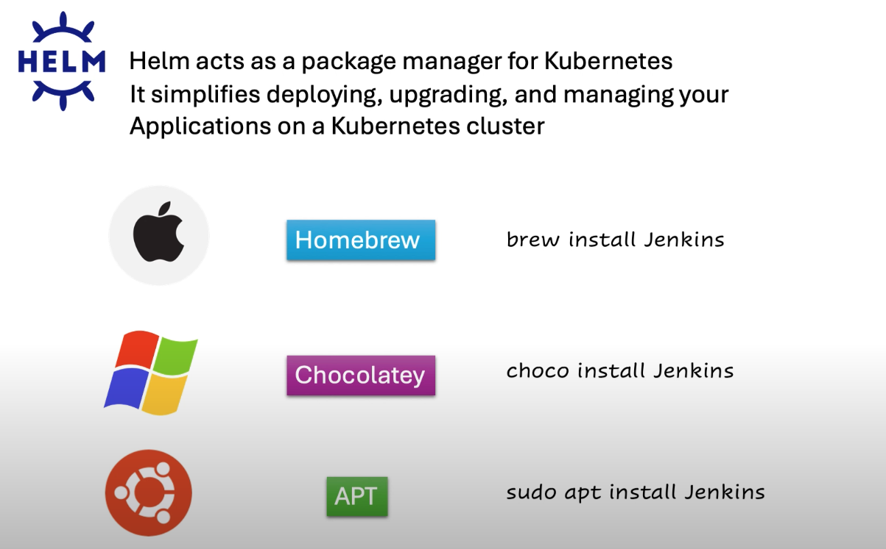
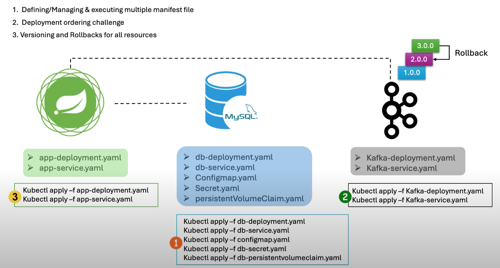
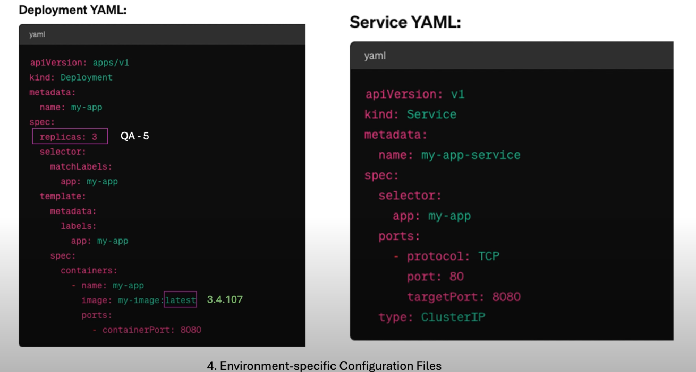
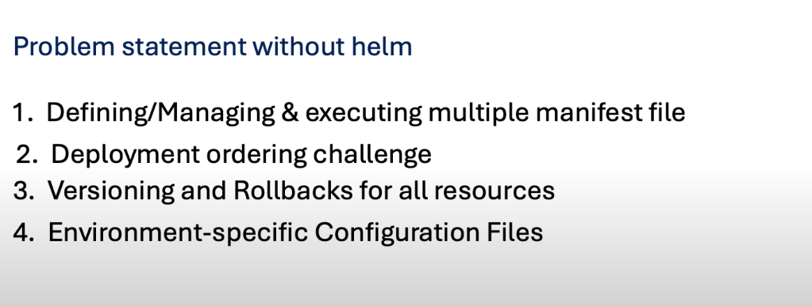
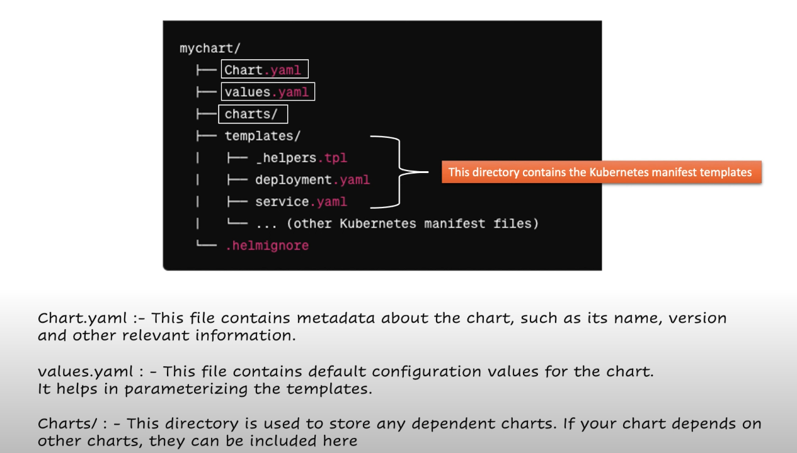
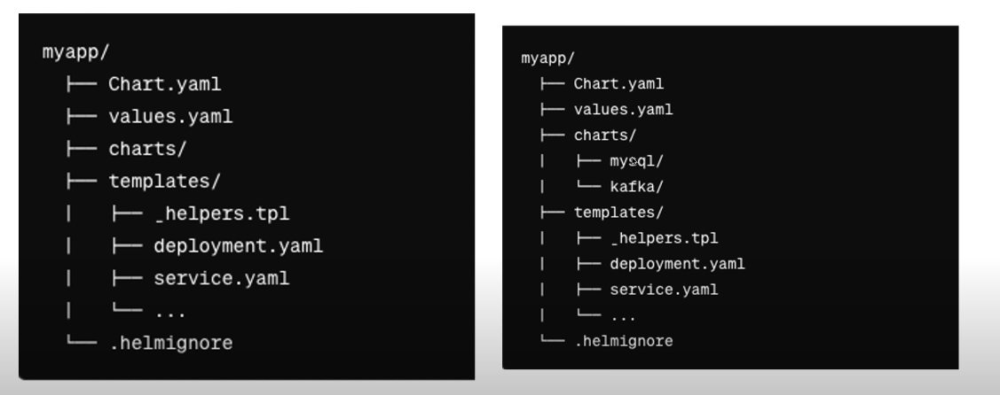
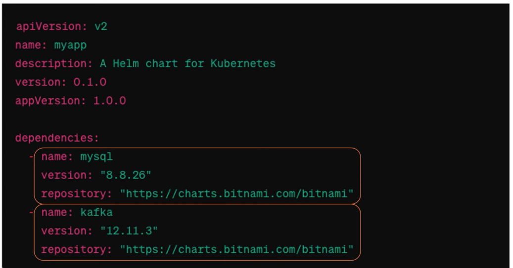
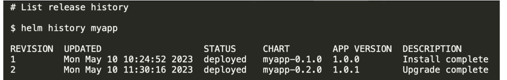
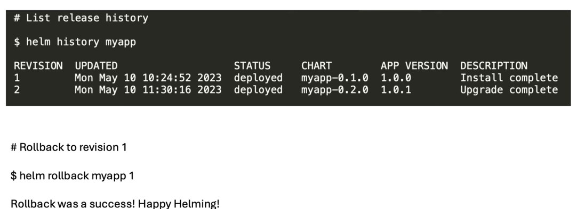
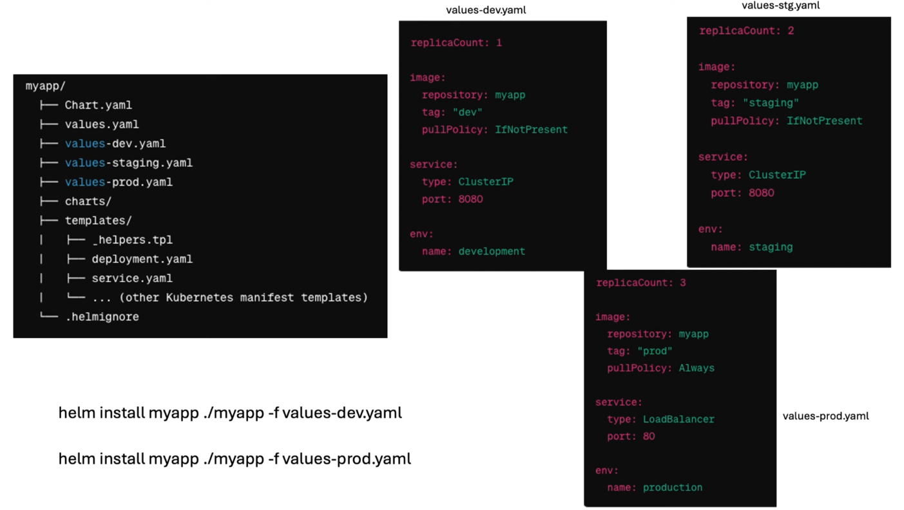

# Helm

- Helps in simplifying management of complex k8s applications.
- Helm acts as a package manager for K8S, it simplifies deploying, upgrading and managing
your applications on k8s cluster.

- What issues is Helm fixing.
- imagine we have a simple application which has springboot as backend, a DB and a Kafka
for this we need to create their respective yaml files.and we need to execute them individually
which can be a quite tedious job.
- We also need to follow the order of execution of the YAML files, else the application will fail.
- We will have updates/versions resources  and rolling back when issues arrives  cannot be done for all at one time, we need to done one by one. 

- For an application Lets check a deployment and service yaml configuration:

1. In a case where i need to increase the pod count in dev region from 3 to 5  as there is testing started, will be challenging as i have already hardcoded/defined the yaml file.

2. In a case when i need to do a perf testing and to choose a different container version 
will be challenging as i have already hardcoded/defined the yaml file.

- This type of environmental configuration issues can be solved using helm.

### Structure of Helm package/chart :
helm also acts as template engine , will generate a standard template for us where we can define our K8s manifest(YAML).

- Note:
here packages and chart are same in K8s world.
in chart folder we can add other charts which will act as  subchart for eg 
 a spring chart can have db and kafka as its subchart(package).

 ### Helm solving the abouve issues.

 #### Generating the YAML manifest files.

 - We can ask Helm to create us yaml teamplates for use and also we can ask Helm to create
 standard sub-chart and we can configure the templates provided by the helm.

 

 ####   Following order of execution of YAML files :
 - We can use helm dependecies, we only need to define the dependecies in chart.yaml
 - This is Chart.yaml for tha app and we have defined the sub-charts.

 

#### Solving the Quick role back challenge.
- Each time when we deploy the app using helm chart(package) it will create a release, which will have
as verrsion number and increase the number of version with each release.

- Lets say i find a bug in latest version which is 2 and now i want to rollback to previous version
i.e 1 , to do this we can just call `helm rollback myapp 1`.

#### Segerating the environment specfifc configuration.
- We have to create a seperate vlaues yaml file for each environments.
