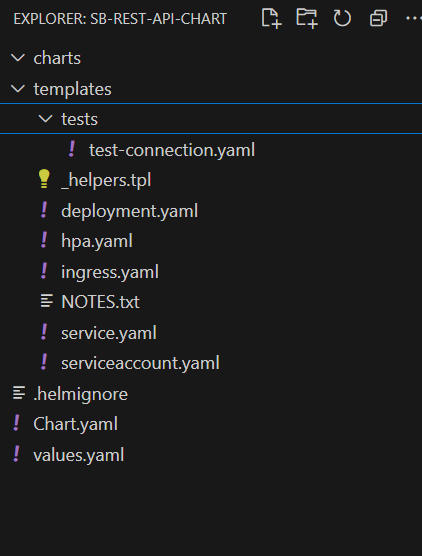
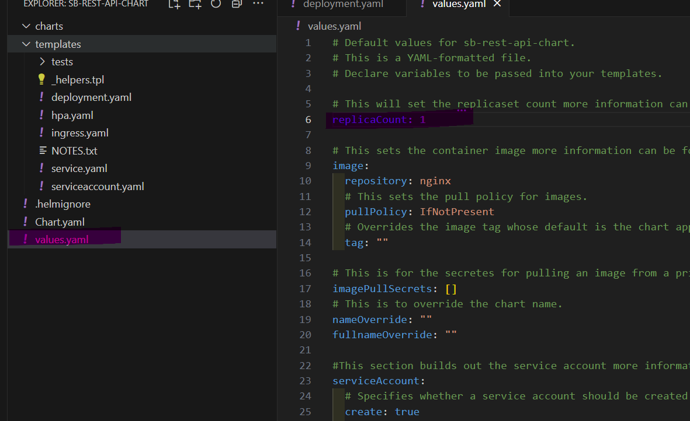
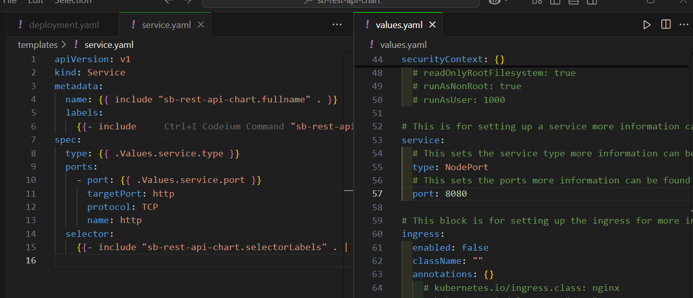
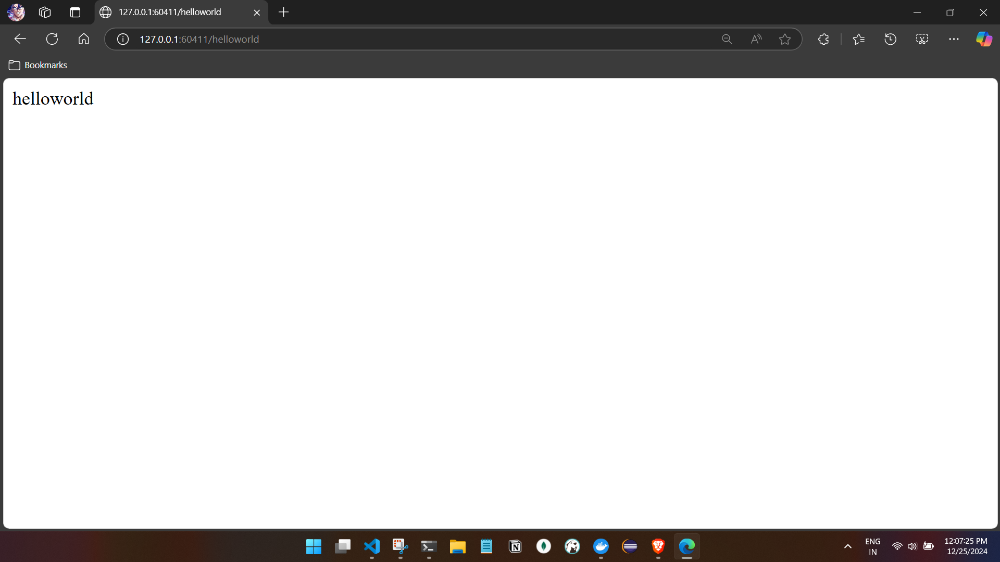
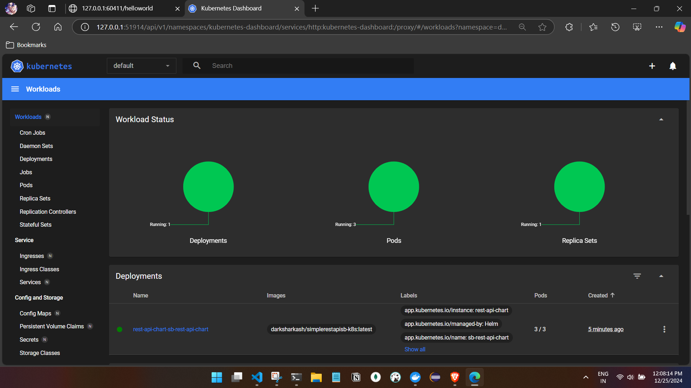

# Helm with using SB REST API:

- We will use already existing container which is nothing but a simple rest api :

- Start the minikube, check the status and check the restapi container:
```
C:\Users\ashfa>minikube start
😄  minikube v1.34.0 on Microsoft Windows 11 Home Single Language 10.0.26100.2605 Build 26100.2605
✨  Using the docker driver based on existing profile
👍  Starting "minikube" primary control-plane node in "minikube" cluster
🚜  Pulling base image v0.0.45 ...
🔄  Restarting existing docker container for "minikube" ...
❗  Failing to connect to https://registry.k8s.io/ from inside the minikube container
💡  To pull new external images, you may need to configure a proxy: https://minikube.sigs.k8s.io/docs/reference/networking/proxy/
🐳  Preparing Kubernetes v1.31.0 on Docker 27.2.0 ...
🔎  Verifying Kubernetes components...
    ▪ Using image docker.io/kubernetesui/dashboard:v2.7.0
    ▪ Using image docker.io/kubernetesui/metrics-scraper:v1.0.8
    ▪ Using image gcr.io/k8s-minikube/storage-provisioner:v5
💡  Some dashboard features require the metrics-server addon. To enable all features please run:

        minikube addons enable metrics-server

🌟  Enabled addons: storage-provisioner, dashboard, default-storageclass
🏄  Done! kubectl is now configured to use "minikube" cluster and "default" namespace by default

C:\Users\ashfa>minikube status
minikube
type: Control Plane
host: Running
kubelet: Running
apiserver: Running
kubeconfig: Configured

--- IMP Docker not configured

--- Configuring docker for minikube

C:\Users\ashfa>minikube docker-env
SET DOCKER_TLS_VERIFY=1
SET DOCKER_HOST=tcp://127.0.0.1:59101
SET DOCKER_CERT_PATH=C:\Users\ashfa\.minikube\certs
SET MINIKUBE_ACTIVE_DOCKERD=minikube
REM To point your shell to minikube's docker-daemon, run:
REM @FOR /f "tokens=*" %i IN ('minikube -p minikube docker-env --shell cmd') DO @%i

C:\Users\ashfa>@FOR /f "tokens=*" %i IN ('minikube -p minikube docker-env --shell cmd') DO @%i

--- Confirm the docker is configured:
C:\Users\ashfa>minikube status
minikube
type: Control Plane
host: Running
kubelet: Running
apiserver: Running
kubeconfig: Configured
docker-env: in-use --configured


C:\Users\ashfa>kubectl get deployments
No resources found in default namespace.

C:\Users\ashfa>kubectl get services
NAME         TYPE        CLUSTER-IP   EXTERNAL-IP   PORT(S)   AGE
kubernetes   ClusterIP   10.96.0.1    <none>        443/TCP   5d22h

C:\Users\ashfa>kubectl get pods
No resources found in default namespace.

C:\Users\ashfa>docker images
REPOSITORY                                TAG        IMAGE ID       CREATED         SIZE
darksharkash/sb-cron-app                  v1         fbd23504b41f   36 hours ago    251MB
darksharkash/vite-react-app               v1         eae90fc8d71d   2 days ago      205MB
darksharkash/sb3j21crud-k8s               latest     60971bf44089   2 days ago      263MB
darksharkash/simplerestapisb-k8s          latest     af010efbe212   5 days ago      204MB  -- will use this image
mysql                                     latest     56a8c14e1404   2 months ago    603MB
registry.k8s.io/kube-scheduler            v1.31.0    1766f54c897f   4 months ago    67.4MB
registry.k8s.io/kube-apiserver            v1.31.0    604f5db92eaa   4 months ago    94.2MB
registry.k8s.io/kube-controller-manager   v1.31.0    045733566833   4 months ago    88.4MB
registry.k8s.io/kube-proxy                v1.31.0    ad83b2ca7b09   4 months ago    91.5MB
registry.k8s.io/etcd                      3.5.15-0   2e96e5913fc0   5 months ago    148MB
registry.k8s.io/pause                     3.10       873ed7510279   7 months ago    736kB
mysql                                     8.0.36     f5f171121fa3   9 months ago    603MB
mysql                                     5.7        5107333e08a8   12 months ago   501MB
registry.k8s.io/coredns/coredns           v1.11.1    cbb01a7bd410   16 months ago   59.8MB
kubernetesui/dashboard                    <none>     07655ddf2eeb   2 years ago     246MB
kubernetesui/metrics-scraper              <none>     115053965e86   2 years ago     43.8MB
gcr.io/k8s-minikube/storage-provisioner   v5         6e38f40d628d   3 years ago     31.5MB


```

- Since we already know helm , we don't want to create the manifest yaml files.
- Asking Helm to create the manifest yaml files for us, We can also ask it to create the
necessary charts, packages for us.

- Creating the chart 
```

C:\Users\ashfa\OneDrive\Desktop\My-Learning\k8s>helm create sb-rest-api-chart
Creating sb-rest-api-chart

C:\Users\ashfa\OneDrive\Desktop\My-Learning\k8s>tree sb-rest-api-chart
Folder PATH listing for volume OS
Volume serial number is 4ACA-228D
C:\USERS\ASHFA\ONEDRIVE\DESKTOP\MY-LEARNING\K8S\SB-REST-API-CHART
├───charts
└───templates
    └───tests

C:\Users\ashfa\OneDrive\Desktop\My-Learning\k8s>
- a directory is created.
```


- as we can see the charts directory is empty as we dont have any dependencies like DB or Kafka etc for the app.
- Checking the deployment yaml file :
  -  we can see the replica section takes dynamic values

  ```
   replicas: {{ .Values.replicaCount }}
  ```
  

  - the values will be taken from values manifest file let us change the value to 3.
  - Image selection and default image.
   we have to provide our container name and default image is niginx.
  - We will provide the container name and tag 
   ```
   image:
  repository: darksharkash/simplerestapisb-k8s
  # This sets the pull policy for images.
  pullPolicy: IfNotPresent
  # Overrides the image tag whose default is the chart appVersion.
  tag: "latest"


   ```

  - We will provide the replica count:
    ```
    replicaCount: 3 

    ```

- Checking the service yaml file
  
  - Changing the values for service from value manifest file.
   

  - We will remove the health check options 

 ```
 livenessProbe:
#   httpGet:
#     path: /
#     port: http
# readinessProbe:
#   httpGet:
#     path: /
#     port: http

comment this section
 ```

- We will ask helm to deploy the manifest files.
```
C:\Users\ashfa\OneDrive\Desktop\My-Learning\k8s>helm list
NAME    NAMESPACE       REVISION        UPDATED STATUS  CHART   APP VERSION

C:\Users\ashfa\OneDrive\Desktop\My-Learning\k8s>helm install rest-api-chart sb-rest-api-chart
NAME: rest-api-chart
LAST DEPLOYED: Wed Dec 25 12:02:40 2024
NAMESPACE: default
STATUS: deployed
REVISION: 1
NOTES:
1. Get the application URL by running these commands:
  export NODE_PORT=$(kubectl get --namespace default -o jsonpath="{.spec.ports[0].nodePort}" services rest-api-chart-sb-rest-api-chart)
  export NODE_IP=$(kubectl get nodes --namespace default -o jsonpath="{.items[0].status.addresses[0].address}")
  echo http://$NODE_IP:$NODE_PORT

```
    - helm install rest-api-chart sb-rest-api-chart 
     asking helm to install rest-api-chart (chart name) by referencing
     our chart which we created earlier.


-  Verifying the application :
```
C:\Users\ashfa\OneDrive\Desktop\My-Learning\k8s>kubectl get deployments
NAME                               READY   UP-TO-DATE   AVAILABLE   AGE
rest-api-chart-sb-rest-api-chart   3/3     3            3           8s

C:\Users\ashfa\OneDrive\Desktop\My-Learning\k8s>kubectl get pods
NAME                                               READY   STATUS    RESTARTS   AGE
rest-api-chart-sb-rest-api-chart-b5b6978bb-bkgfr   1/1     Running   0          13s
rest-api-chart-sb-rest-api-chart-b5b6978bb-dsxg6   1/1     Running   0          13s
rest-api-chart-sb-rest-api-chart-b5b6978bb-pktjl   1/1     Running   0          13s

C:\Users\ashfa\OneDrive\Desktop\My-Learning\k8s>kubectl get service
NAME                               TYPE        CLUSTER-IP       EXTERNAL-IP   PORT(S)          AGE
kubernetes                         ClusterIP   10.96.0.1        <none>        443/TCP          6d
rest-api-chart-sb-rest-api-chart   NodePort    10.105.150.217   <none>        8080:31825/TCP   17s

C:\Users\ashfa\OneDrive\Desktop\My-Learning\k8s>kubectl logs rest-api-chart-sb-rest-api-chart-b5b6978bb-bkgfr

  .   ____          _            __ _ _
 /\\ / ___'_ __ _ _(_)_ __  __ _ \ \ \ \
( ( )\___ | '_ | '_| | '_ \/ _` | \ \ \ \
 \\/  ___)| |_)| | | | | || (_| |  ) ) ) )
  '  |____| .__|_| |_|_| |_\__, | / / / /
 =========|_|==============|___/=/_/_/_/
 :: Spring Boot ::                (v3.0.1)

2024-12-25T06:32:47.145Z  INFO 1 --- [           main] s.r.SpringBoot3RestApiExampleApplication : Starting SpringBoot3RestApiExampleApplication v0.0.1-SNAPSHOT using Java 17.0.13 with PID 1 (/app/app.jar started by root in /app)
2024-12-25T06:32:47.243Z  INFO 1 --- [           main] s.r.SpringBoot3RestApiExampleApplication : No active profile set, falling back to 1 default profile: "default"
2024-12-25T06:32:55.552Z  INFO 1 --- [           main] o.s.b.w.embedded.tomcat.TomcatWebServer  : Tomcat initialized with port(s): 8080 (http)
2024-12-25T06:32:55.651Z  INFO 1 --- [           main] o.apache.catalina.core.StandardService   : Starting service [Tomcat]
2024-12-25T06:32:55.651Z  INFO 1 --- [           main] o.apache.catalina.core.StandardEngine    : Starting Servlet engine: [Apache Tomcat/10.1.4]
2024-12-25T06:32:56.350Z  INFO 1 --- [           main] o.a.c.c.C.[Tomcat].[localhost].[/]       : Initializing Spring embedded WebApplicationContext
2024-12-25T06:32:56.353Z  INFO 1 --- [           main] w.s.c.ServletWebServerApplicationContext : Root WebApplicationContext: initialization completed in 8497 ms
2024-12-25T06:32:59.445Z  INFO 1 --- [           main] o.s.b.w.embedded.tomcat.TomcatWebServer  : Tomcat started on port(s): 8080 (http) with context path ''
2024-12-25T06:32:59.650Z  INFO 1 --- [           main] s.r.SpringBoot3RestApiExampleApplication : Started SpringBoot3RestApiExampleApplication in 14.292 seconds (process running for 16.991)

C:\Users\ashfa\OneDrive\Desktop\My-Learning\k8s>minikube service rest-api-chart-sb-rest-api-chart
|-----------|----------------------------------|-------------|---------------------------|
| NAMESPACE |               NAME               | TARGET PORT |            URL            |
|-----------|----------------------------------|-------------|---------------------------|
| default   | rest-api-chart-sb-rest-api-chart | http/8080   | http://192.168.49.2:31825 |
|-----------|----------------------------------|-------------|---------------------------|
🏃  Starting tunnel for service rest-api-chart-sb-rest-api-chart.
|-----------|----------------------------------|-------------|------------------------|
| NAMESPACE |               NAME               | TARGET PORT |          URL           |
|-----------|----------------------------------|-------------|------------------------|
| default   | rest-api-chart-sb-rest-api-chart |             | http://127.0.0.1:60411 |
|-----------|----------------------------------|-------------|------------------------|
🎉  Opening service default/rest-api-chart-sb-rest-api-chart in default browser...
❗  Because you are using a Docker driver on windows, the terminal needs to be open to run it.

```
- Application:


- Minikube dashboard:


- Summary:
 - we were able to deploy and run the app from helm easily.
 - we did not create manifest yaml files, did apply them by kubectl command, we did not hardcode any values.

- understanding the version control of application:
for each time we deploy the same app with different version, we can see and control in case of reverting to the previous version by the help of revision number and chart name if there are any issues in current version.

```
C:\Users\ashfa\OneDrive\Desktop\My-Learning\k8s\sb-rest-api-chart>helm list
NAME            NAMESPACE       REVISION        UPDATED                                 STATUS          CHART                   APP VERSION
rest-api-chart  default         1               2024-12-25 12:02:40.999792 +0530 IST    deployed        sb-rest-api-chart-0.1.0 1.16.0

C:\Users\ashfa\OneDrive\Desktop\My-Learning\k8s\sb-rest-api-chart>
```